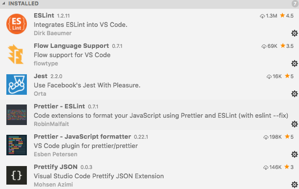
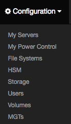

# <a name="Top"></a>Contributing to the IML Frontend

[**Software Contributor Documentation Table of Contents**](cd_TOC.md)


## General

- [How to Contribute to Open Source](https://opensource.guide/how-to-contribute/)

## Prerequisites

### The installation of an IDE/Editor to develop IML code is not mandatory, however, the following recommendations are highly recommended:

- Install an IDE/Editor such as [VS Code](https://code.visualstudio.com/), [Atom](https://atom.io/) or [Sublime](https://www.sublimetext.com/).
- For this guide, the [VS Code IDE/Editor](https://code.visualstudio.com/Download) has been installed along with the following plugins:

  - ESLint
  - Prettier - ESLint
  - Flow Language Support
  - Jest

  

- To modify and test any Frontend changes to IML, it will be necessary to install a working version of IML.

  - Create a **Vagrant** virtual cluster outlined here: [Install IML on a Vagrant Virtual Cluster](cd_Installing_IML_On_Vagrant.md).

  - Create a Shared Mount from the guest machine to the vagrant virtual machine.
    - Follow these [Instructions](cd_Create_Vagrant_Mount.md)

## On the Local machine, i.e., not the vagrant virtual machine.

For the desciption that follows, it will be assumed that the Vagrant file and virtual machine information reside in the directory:

```
~/vagrant-projects/vhpc
```

## Contributing to the IML Frontend

### Clone the Frontend repo, aka, the [GUI](https://github.com/whamcloud/GUI) repo

```
cd ~/vagrant-projects/vhpc
git clone git@github.com:whamcloud/GUI.git
```

### Create a branch, always work on a branch.

```
cd GUI
git checkout -b  my-fix
```

### Validate that the correct branch has been selected.

```
git branch
```

### Work on the branch.

```
Use VS Code and open ~/vagrant-projects/vhpc/GUI
```

### As an Example, make a small change to the **Configuration** dropdown menu.

In VS Code, locate and edit the following file: **app-states.js**

```
GUI
  > source
    > iml
      > app
        > app-states.js

Search for "Servers"
```

On the line containing "Servers", change **Servers** to **My Servers**:

Change this line:

```
<li><a tabindex="-1" id="server-conf-item" ui-sref="app.server({ resetState: true })">Servers</a></li>
```

To look like this line:

```
<li><a tabindex="-1" id="server-conf-item" ui-sref="app.server({ resetState: true })">My Servers</a></li>
```

Save the file: **app-states.js**

## Install dependencies and build the code

### Install yarn

Before you start using Yarn, you'll first need to install it on your system.

- How to [Install yarn](https://yarnpkg.com/lang/en/docs/install/)

If yarn is installed properly, Install the external library dependencies

Type the command:

```
yarn install
```

Build the code and Pass all required tests listed in **package.json**

```
yarn watch
```

The watch command will leave the code in a state that will "watch" for further edits. If desired, the "watch" may be stopped by hitting ctrl-c

### In a seperate terminal, log into the **adm** node

- `vagrant ssh adm`

Log in as root

- `su -`

### Stop the IML running services

- `chroma-config stop`

### Create a symbolic link to the **gui** that is running on the **adm** node with the newly cloned **gui**.

The gui files currently reside at /usr/lib/iml-manager/iml-gui on the running system.

- `cd /usr/lib/iml-manager`

Preserve the original iml-gui files.

- `mv iml-gui iml-gui-orig`

Create the symbolic link.

- `ln -s /vagrant/GUI/dist iml-gui`

### Start the IML services

- `chroma-config start`

## In a browser, go to the IML location

- [https://adm.lfs.local:8443](https://adm.lfs.local:8443)

## Verify that the small change worked.

It is possible that the browser cache may require refreshing for the change to take place.

- Click on
  - Configuration
  - Verify that the pull down menu has the item: "My Servers"
  - The image below also shows a change for "My Power Control"



---

# Congratulations! You just made a change to the IML Frontend code.

---

## The process outlined above is the basic technique for modifying the Frontend IML code.

## A note about starting and stopping chroma-config

- The amount of time to complete

  - chroma-config start
  - chroma-config stop

- can be time consuming, however, the commands are still an effective way to ensure that all processes start and stop.

- A faster method to restart just the "view_server" process can be accomplished as follows:

  - **supervisorctl -c /usr/share/chroma-manager/production_supervisord.conf restart view_server**

* To check the IML services status

  - **supervisorctl -c /usr/share/chroma-manager/production_supervisord.conf status**

# Pushing the code change to github

### On your local machine, i.e., not the vagrant VM:

- `cd ~/vagrant-projects/vhpc/GUI`

Ensure you are on the proper branch

- `git branch`

Otherwise, change to the **my-fix** branch

- `git checkout my-fix`

Add and Commit the change.

- `git status`

- `git add source/iml/app/app-states.js`

- `git commit -s`

This will cause the **pre-commit** hooks to run.

Add the following comment:

```
This is a test fix for the frontend

 - Changed the Configuration dropdown label for Servers
```

- Save the commit

## [Push to github](./cd_Push_To_Github.md)

---

[Top of page](#Top)
