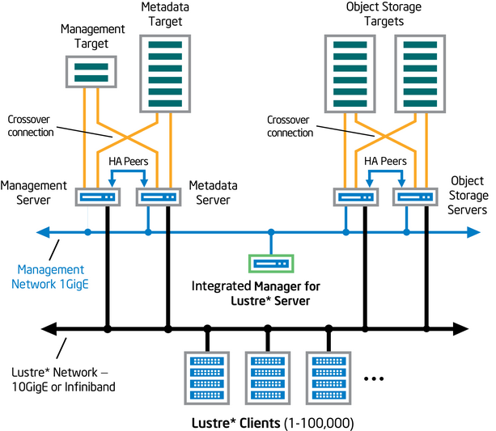
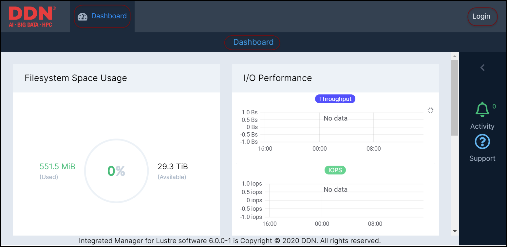
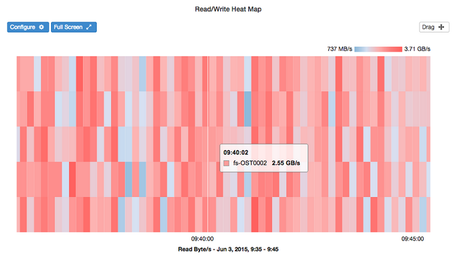
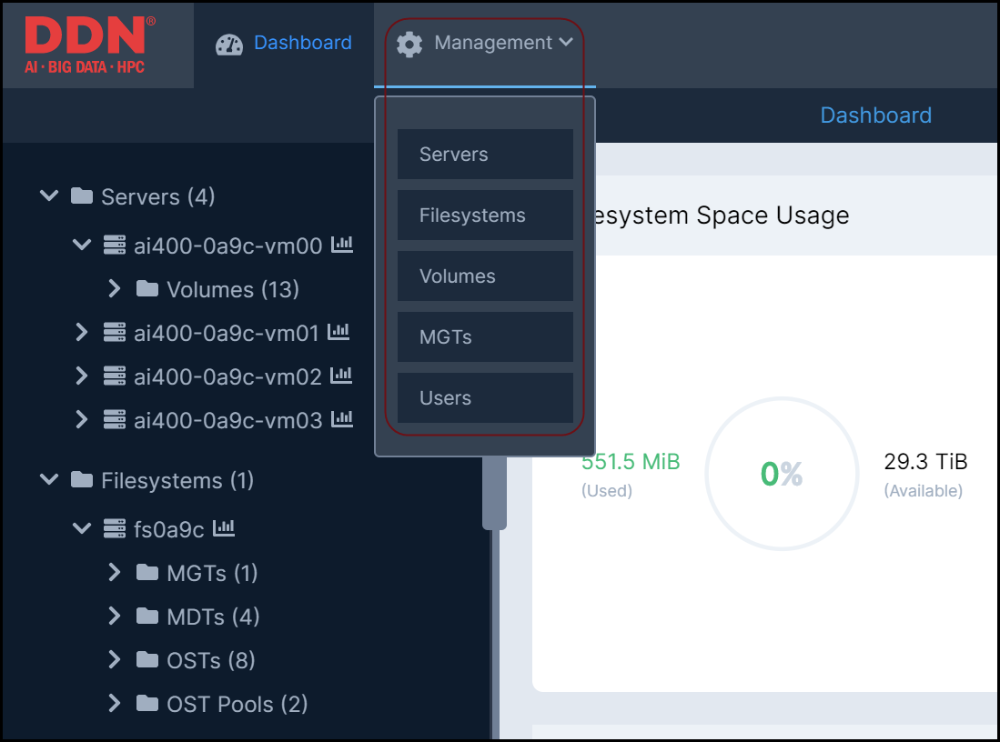
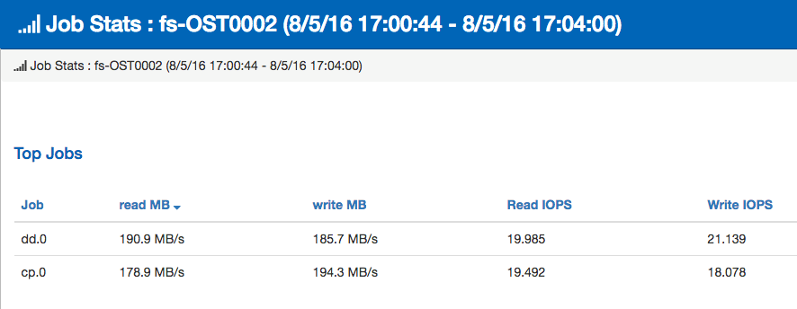
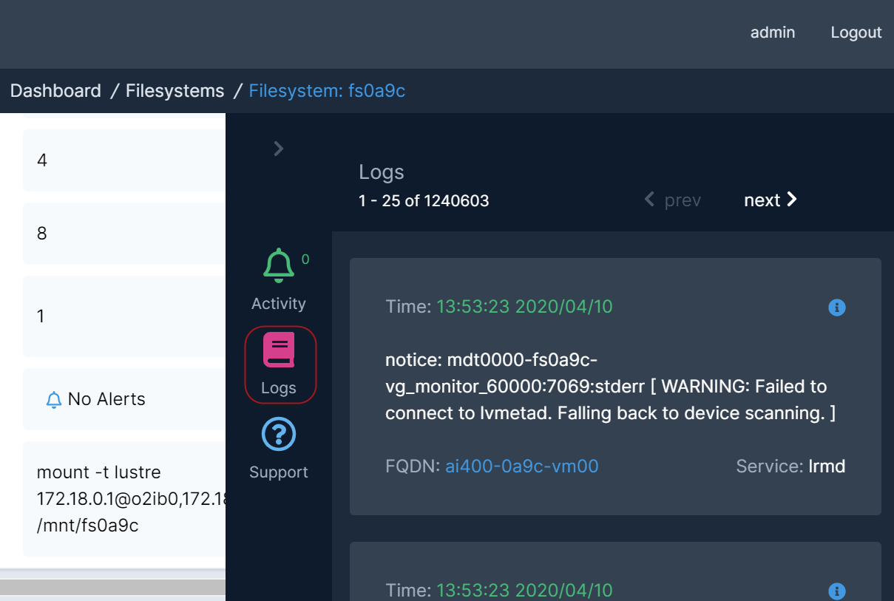
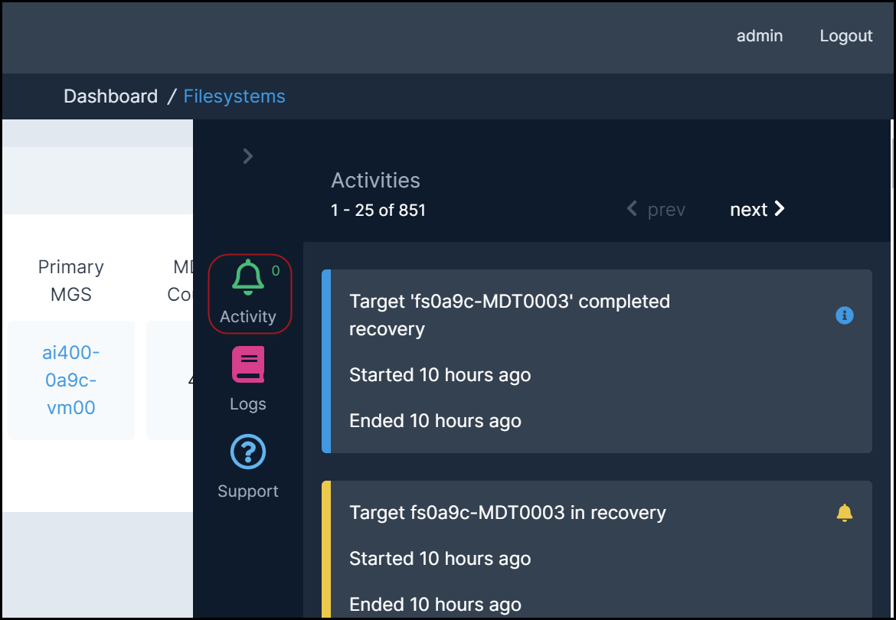
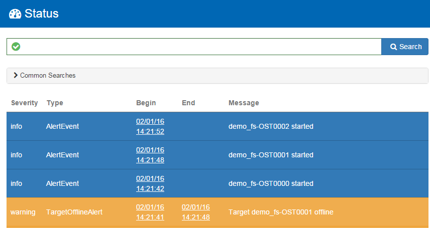

# Introducing Integrated Manager for Lustre software

[**Online Help Table of Contents**](IML_Help_TOC.md)

**In this Chapter:**

- [Overview of Integrated Manager for Lustre software](#overview-of-integrated-manager-for-lustre-software)
- [Key Features](#key-features)
- [Management mode versus Monitor-only mode](#management-mode-versus-monitor-only-mode)
- [Overview of the graphical user interface](#overview-of-the-graphical-user-interface)
  <!-- - [Menu bar](#menu-bar)-->
  - [Dashboard](#dashboard)
  - [Charts](#charts)
  - [Management menu](#management-menu)
  <!-- - [Job stats](#job-stats)-->
  - [Logs](#logs)
  <!-- - [Help](#help)-->
  - [Activities](#activities)
  <!-- - [Alert Bar](#alert-bar)-->
- [Access the Dashboard from a smartphone or tablet](#access-the-dashboard-from-a-smartphone-or-tablet)

Enterprises and institutions of all sizes use high performance computing to solve today's most intense computing challenges. Just as compute clusters exploit parallel processors and development tools, storage solutions must be parallel to deliver the sustained performance at the large scales that today's applications require. The Lustre file system is the ideal distributed, parallel file system for high performance computing.

Accordingly, as storage solutions continue to grow in complexity, powerful, yet easy-to-use software tools to install, configure, monitor, manage, and optimize Lustre-based solutions are essential. Integrated Manager for Lustre software is purpose-built to simplify the deployment and management of Lustre-based solutions. Integrated Manager for Lustre software reduces management complexity and costs, enabling storage superusers to exploit the performance and scalability of Lustre storage, and accelerate critical applications and work flows.

Integrated Manager for Lustre software greatly simplifies the creation and management of Lustre file systems, using either the graphical user interface (GUI) or a command line interface (CLI). The GUI dashboard lets you monitor one or more distributed Lustre file systems. Real-time storage-monitoring lets you track Lustre file system usage, performance metrics, events, and errors at the Lustre level. Plug-ins provided by storage solution providers enable monitoring of hardware-level performance data, disk errors and faults, and other hardware-related information.

Integrated Manager for Lustre software, when integrated with Linux, aggregates a range of storage hardware into a single Lustre file system that is well-proven for delivering fast IO to applications across high-speed network fabrics such as InfiniBand\* and Ethernet.
An existing Lustre file system that has been set up outside of Integrated Manager for Lustre software can be monitored, but not managed by the manager. In this case, Lustre commands can be used to manage metadata or object storage servers in the Lustre file system.

[Top of Page](#introducing-integrated-manager-for-lustre-software)

## Overview of Integrated Manager for Lustre software

Integrated Manager for Lustre software is a global single-namespace file system architecture that allows parallel access by many clients to all the data in the file system across many servers and storage devices. Designed to take advantage of the reliability features of enterprise-class storage hardware, Integrated Manager for Lustre software supports availability features such as redundant servers with storage failover. Metadata and data are stored on separate servers to allow each system to be optimized for the different workloads. The components of an Integrated Manager for Lustre software file storage system include the following:

- Integrated Manager for Lustre software server: The server that hosts the Integrated Manager for Lustre software and GUI, and is the server from which Lustre file systems are created, monitored, and managed. Connected to storage servers via the administrative LAN. This is distinct from the management server, which provides access to the management target.
- Management server(s) (MGS): Provide access to the management target. Paired, redundant management servers provide server failover (high availability) in the event of a server failure.
- Management target (MGT): The MGT stores configuration information for all the Lustre file systems in a cluster and provides this information to other Lustre components. Each Lustre object storage target (OST) contacts the MGT to provide information, and Lustre clients contact the MGT to retrieve information. The MGT can be no larger than 10 gigabytes.
- Object storage servers (OSS): Storage servers provide access to the management target, the metadata target, and the storage targets. Paired, redundant storage servers provide server failover (high availability) in the event of a server failure.
- Metadata server (MDS): Metadata servers contain one or more Metadata Targets (MDTs). The MDS is in charge of pathname and permission checks and is not responsible for file I/O operations.
- Metadata target (MDT): The MDT stores metadata (such as file names, directories, permissions, and file layout) for attached storage and makes this available to clients. Typically, each file system has one MDT, however the Integrated Manager for Lustre software supports multiple MDTs.
- Object storage targets (OSTs) - User file data is stored in one or more objects that are located on separate OSTs in the file system. The number of objects per file is configurable by the user and can be tuned to optimize performance for a given workload.
- Lustre clients - Lustre clients are computational, visualization, or desktop nodes that are running Lustre client software, allowing them to mount the Lustre file system.

The servers on which the MGT, MDT, or OSTs are located can all be configured as high-availability (HA) servers, so that if a server for a target fails, a standby server can continue to make the target available.

[Top of Page](#introducing-integrated-manager-for-lustre-software)

## Key Features

The following entries are key features of Integrated Manager for Lustre software:

## GUI-based creation and management of Lustre file systems

The Integrated Manager for Lustre software provides a powerful, yet easy-to-use GUI that <!--enables rapid creation of Lustre file systems. The GUI supports easy configuration for high availability and expansion, and -->enables performance monitoring and management of multiple Lustre file systems. <!--See [Creating a new Lustre file system](Creating_new_lustre_fs_3_0.md/#3.0).-->In future releases, the GUI is also going to support rapid creation of Lustre file systems as well as their easy configuration for high availability and expansion.

## Graphical charts display real-time performance metrics

Color charts display a variety of real-time performance metrics for single or multiple file systems with detailed output for both individual servers and targets. These metrics are rendered using the various [charts](#summary-of-charts).

<!-- - [Read/Write Heat Map chart](Graphical_User_Interface_9_0.md/#9.2.1) -->
<!-- - [OST Balance chart](Graphical_User_Interface_9_0.md/#9.2.2)-->
<!-- - [Metadata Operations chart](Graphical_User_Interface_9_0.md/#9.2.3)-->
<!-- - [Read/Write Bandwidth chart](Graphical_User_Interface_9_0.md/#9.2.4)-->
<!-- - [Metadata Servers chart](Graphical_User_Interface_9_0.md/#9.2.5)-->
<!-- - [Object Storage Servers chart](Graphical_User_Interface_9_0.md/#9.2.6)-->
<!-- - [CPU Usage chart](Graphical_User_Interface_9_0.md/#10.2.3.2)-->
<!-- - [Memory Usage chart](Graphical_User_Interface_9_0.md/#10.2.3.3)-->
<!-- - [Space Usage chart](Graphical_User_Interface_9_0.md/#9.2.9)-->
<!-- - [File Usage chart](Graphical_User_Interface_9_0.md/#9.2.10)-->
<!-- - [Object Usage chart](Graphical_User_Interface_9_0.md/#9.2.11)-->

<!--See [View charts on the Dashboard](Monitoring_lustre_fs_4_0_0.md/#4.1).-->

## Auto-configured high-availability clustering for server pairs

Pacemaker and Corosync are configured automatically when the system design follows configuration guidance. This removes the need for manually installing HA configuration files on storage servers, and simplifies high-availability configuration. See [High-availability file system support](Creating_new_lustre_fs_3_0.md/#3.3).

## PDU configuration and server outlet assignments support automatic failover

The PDU window lets you configure and manager power distribution units. At this window you can add a detected PDU and assign specific PDU outlets to specific servers. When you associate PDU failover outlets with servers using this tool, STONITH is automatically configured.

## IPMI and BMC Configuration

An alternative to PDU configuration, support for Intelligent Platform Management Interface and baseboard management controllers support server monitoring, high-availability configuration, and failover.

Integrated Manager for Lustre client software can be installed and configured to run on Intel® Xeon Phi™ Coprocessor clients. This means that the Intel® Xeon Phi™ Coprocessor clients can directly mount Lustre.

## Hierarchical Storage Management

Integrated Manager for Lustre software includes support for hierarchical storage management. HSM provides a way to free up file system storage capacity by archiving the less-frequently accessed files into secondary, archival storage. You can configure the HSM framework directly from the Integrated Manager for Lustre software GUI.

## Robinhood Policy Engine

The Robinhood policy engine has been incorporated into Lustre and is included with Integrated Manager for Lustre software. Integrated Manager for Lustre software performs the provisioning of the Robinhood agent server, which is performed via the manager GUI. Robinhood can be used with the HSM capabilities described above to automate HSM archiving and report generation.

## Apache Hadoop\* adapter software

Integrated Manager for Lustre software is supported by the Apache Hadoop\* adapter software, however the adapter software is a separate download. This Hadoop adapter for Lustre is compatible with the Apache Hadoop software<!--, versions 2.3 and 2.5 as of this writing-->. Hadoop software allows users who run MapReduce jobs to bypass storing data in HDFS, and store the MapReduce output directly to Lustre instead. This allows the analytical processes direct access to scientific output instead of transferring data from the compute cluster storage system to another file system. Optimizations have also been made to the shuffle step in MapReduce to take advantage of Lustre’s high-speed network access to data. Many workloads will see an overall reduction in end-to-end processing time by using the Hadoop adapter with the Integrated Manager for Lustre software file system. For more information, see [Hadoop Adaptor for Lustre](https://github.com/whamcloud/lustre-connector-for-hadoop/blob/master/Installation%20of%20HAL%20on%20Apache%20Hadoop.md).

## Automated Provisioning of Custom Lustre Service Nodes

This feature allows users to create custom profiles for new Lustre client types and based on a given profile, deploy and install custom code to provide new services. HSM copytool (above) is deployed in this way. Other services might include Samba file services, etc.

## Simplified ISO-less installation and automated deployment mechanism streamlines overall installation

The installation strategy removes the need to manually install the software on each server. Integrated Manager for Lustre software is quickly installed on the manager server while required packages are automatically deployed to all storage servers. Storage servers and the manager server can run the same standard operating system as the rest of your estate. Additional software built for CentOS or Red Hat will also work on servers managed by Integrated Manager for Lustre software.

**Note:** The manager server is the server where the Integrated Manager for Lustre software dashboard is installed.

## Support for OpenZFS in Management Mode

Integrated Manager for Lustre software supports ZFS as a back-end file system replacement for ldiskfs. It has the ability to configure and manage high-availability Lustre storage solutions and discover / manage ZFS file systems. See [Creating and Managing ZFS-based Lustre file systems](Create_and_manage_ZFS_based_LFS_8_0.md/#8.0).

## Integrated Manager for Lustre software ZFS Snapshots

The OpenZFS file system provides integrated support for snapshots, a data protection feature that enables an operator to checkpoint a file system volume. In Integrated Manager for Lustre software, Intel® has developed a mechanism in Lustre that leverages ZFS to take a coordinated snapshot of an entire Lustre file system, if all of the storage targets in the file system are formatted using ZFS.

## HPC Job Scheduler integration with MapReduce

Integrated Manager for Lustre software works with the HPC job scheduler to integrate MapReduce; however, the job scheduler integration is a separate download. The HPC job scheduler integration supports Apache Hadoop. This adapter for job schedulers allows you to integrate common resource schedulers into your cluster. You have the choice of installing the SLURM (Simple Linux Utility for Resource Management) job scheduler integration or the PBS (portable batch system) job scheduler integration.

Hadoop commonly uses Yarn to manage MapReduce jobs. Installing more than one job scheduler (such as SLURM and Yarn) on a single system can cause problems. The HPC Job Scheduler integration with MapReduce replaces YARN with an interface to the main resource manager for the system. This allows MapReduce applications to be run as normal HPC jobs.

## Apache Hive compatibility

Hive is a data warehouse infrastructure built on top of Hadoop for providing data summarization, query, and analysis. Intel® has tested the Hadoop adapter for Lustre provided with Integrated Manager for Lustre software for compatibility with Apache Hive version 2.3.

## Apache Hbase compatibility

HBase is a non-relational, distributed database modeled after Google's BigTable and written in Java\*. Hbase runs on top of HDFS (Hadoop Distributed File System). Intel® has tested the Hadoop adapter for Lustre provided with Integrated Manager for Lustre software for compatibility with Apache Hbase version 2.5.

## Lustre {{site.lustre_version}}

This release of Integrated Manager for Lustre software is based on the Intel® Foundation Edition for Lustre {{site.lustre_version}} release tree, representing a major update to the underlying Lustre version for the Integrated Manager for Lustre software (as of version {{site.version}}).

## Online Lustre File System Consistency Checks (LFSCK)

LFSCK is an administrative tool that was first introduced in Lustre software release 2.3 for checking and repairing attributes specific to a mounted Lustre file system. LFSCK is similar in concept to an offline FSCK repair tool for a local file system, but LFSCK is implemented to run as part of the Lustre file system while the file system is mounted and in use. LFSCK allows consistency checking and repair by the Lustre software without downtime, and can be run on the largest Lustre file systems with negligible disruption to normal operations.

## Distributed Namespace

Distributed Namespace (DNE) allows the Lustre metadata to be distributed across multiple metadata servers. Integrated Manager for Lustre software supports DNE1 (as of release 2.3.0.0), which supports the use of multiple MDTs. This enables the size of the Lustre namespace and metadata throughput to be scaled with the number of OSSs. This feature is going to be supported in future releases of the Integrated Manager for Lustre software GUI.

## DNE II Striped Directories Support (Preview)

Striped directories support (Distributed Name Space, phase 2) is available in Integrated Manager for Lustre software, as of version 3.0, as a technology preview. Striped directories allow operators to shard directory entries across multiple metadata storage targets, providing both namespace and metadata performance scalability.

## Single Client Metadata Concurrency

Also referred to as `multi-slot last_rcvd`, this update to the metadata communications interface between client and server allows multiple metadata RPCs to be in flight in parallel, per-client for both read and write transactions. Prior to this release, any client RPCs that modified file system metadata (for example, creates or unlinks), were sent serially to the server. With this update, this restriction is removed.

## Differentiated Storage Services

Differentiated Storage Services (DSS) allows I/O data to be classified, sometimes referred to as `hinting`. These hints pass seamlessly through Integrated Manager for Lustre software, at which point data can be tiered and intelligently cached by the storage system. This enables a more efficient use of cache space and decreases the likelihood of critical data being evicted when the cache fills. Intel® is working directly with storage and cache vendors to enable DSS hinting in Lustre appliances, and to provide optimized performance to Integrated Manager for Lustre software deployments with a mix of SSD and traditional storage.

## Support for Intel® Omni-Path Architecture

Intel® Omni-Path fabric support is available for Integrated Manager for Lustre software systems running RHEL {{site.centos_version}}. (Intel® OPA driver support requires RHEL 7.1 or newer, and so is not available for RHEL 6.x based systems.)

## LNet Configuration

This feature assists in configuring LNet for a given server’s network interface by setting the LNet network ID for that port. IML supports the configuration of multiple LNet interfaces.

## Dynamic LNet Configuration

Dynamic LNet configuration (DLC) is a powerful extension of the LNet software to simplify system administration tasks for Lustre networking. DLC allows an operator to make changes to LNet (for example, network interfaces can be added and removed, or parameters changed,) without requiring that the kernel modules be removed and reloaded. Parameters can be altered while LNet is still running, meaning that tuning and optimization can be conducted while Lustre is still running on the target node. Dynamic LNet configuration also applies to LNet routers, so that routes can be added, removed and updated without affecting other Lustre network traffic.

## Kerberos Network Authentication and Encryption

Kerberos provides a means for authentication and authorization of participants on a computer network, as well as providing secure communications through authentication. This functionality has been applied to Integrated Manager for Lustre software for the purposes of establishing trust between Lustre servers and clients, and optionally, supporting encrypted network communications.

[Top of Page](#introducing-integrated-manager-for-lustre-software)

## Management mode versus Monitor-only mode

### Management Mode Explained

The Integrated Manager for Lustre software lets you create and manage new HA Lustre file systems from its GUI. For each HA file system, the GUI and dashboard let you create, monitor, and manage all servers and their respective targets. The software lets you define failover servers to support HA. RAID-based fault tolerance for storage devices is implemented independent of Integrated Manager for Lustre software.

To provide robust HA support, Integrated Manager for Lustre software automatically configures Corosync and Pacemaker, and takes advantage of IPMI or PDUs to support server failover.

**Note:** Managed HA support requires that your entire storage system configuration and all interfaces be compliant with a pre-defined configuration. See [The High Availability Configuration Spec](Install_Guide/ig_ch_03_building.md) for more details.

**Note:** Management mode is supported in Integrated Manager for Lustre software, versions {{site.version}} and later. No claims of support are made for any versions of Lustre outside of that shipped with Integrated Manager for Lustre software.

### Monitor-only Mode Explained

Monitor-only mode allows you to “discover” an existing Lustre file system using Integrated Manager for Lustre software. You can then monitor the file system in the Integrated Manager for Lustre software dashboard. All of the charts presented on the manager dashboard to monitor performance and statistics, are available in monitor-only mode.

Monitor-only mode can be used to establish monitoring for file systems that don’t fully conform to the High Availability Configuration Specification. In this situation, the Corosync and Pacemaker configuration modules provided with Integrated Manager for Lustre software are not automatically deployed. This means that Integrated Manager for Lustre software cannot configure the file system for server failover.

**Note:** RAID-based fault tolerance for storage devices are implemented independent of Integrated Manager for Lustre software.

[Top of Page](#introducing-integrated-manager-for-lustre-software)

## Overview of the graphical user interface

This section provides an overview of the Integrated Manager for Lustre software GUI. For a complete description of the GUI, see [Graphical User Interface](Graphical_User_Interface_9_0.md).

The Integrated Manager for Lustre software GUI presents a set of intuitive windows that let you <!--set up, configure, monitor, and manage-->monitor and manage Lustre file systems. File system setup and configuration are going to be added in future GUI releases. The Dashboard window provides access to these capabilities. Click the following links for overview information:

<!-- - [Menu bar](#menu-bar)-->
- [Dashboard](#dashboard)
- [Charts](#charts)
- [Management menu](#management-menu)
<!-- - [Jobs Stats](#jobs-status)-->
- [Logs](#logs)
<!-- - [Help](#help)-->
- [Activities](#activities)
<!-- - [Alert bar](#alert-bar)-->

<!--### Menu bar -->

<!--The Following is the top menu bar. From here you can access the entire GUI, view the collective status of all file systems and devices, and also access Help. -->

<!--  -->

### Dashboard

The Dashboard displays a set of charts that provide usage and performance data at several levels in the file systems being monitored. At the top level, this window displays an aggregate view of all file systems. You can select to view and monitor individual file systems and servers in the Dashboard. <!--To view a single file system, click _Configure Dashboard_ and under _File System_, select the desired file system.-->

The following is a partial view of the Dashboard.

### Charts

The Dashboard presents several charts that display rich visual information about the current and historical performance of each Lustre file system. <!--Following is an example of the Read/Write Heat Map, which is a color-coded map revealing the level of read/write activity per OST, over time.-->

<!--  -->

The following charts are available. <!--For more information, see [View charts on the Dashboard](Monitoring_lustre_fs_4_0_0.md/#4.1).-->For more information, see the overview of the [Graphical User Interface](Graphical_User_Interface_9_0.md).

<!--
- [Read/Write Heat Map chart](Graphical_User_Interface_9_0.md/#9.2.1)
- [OST Balance chart](Graphical_User_Interface_9_0.md/#9.2.2)
- [Metadata Operations chart](Graphical_User_Interface_9_0.md/#9.2.3)
- [Read/Write Bandwidth chart](Graphical_User_Interface_9_0.md/#9.2.4)
- [Metadata Servers chart](Graphical_User_Interface_9_0.md/#9.2.5)
- [Object Storage Servers chart](Graphical_User_Interface_9_0.md/#9.2.6)
- [CPU Usage chart](Graphical_User_Interface_9_0.md/#9.2.7)
- [Memory Usage chart](Graphical_User_Interface_9_0.md/#9.2.8)
- [Space Usage chart](Graphical_User_Interface_9_0.md/#9.2.9)
- [File Usage chart](Graphical_User_Interface_9_0.md/#9.2.10)
- [Object Usage chart](Graphical_User_Interface_9_0.md/#9.2.11)
-->
- On the main Dashboard (for all file systems):
  - Filesystem Space Usage
  - I/O Performance
  - OST Balance
  - LNet Performance

- On the Server dashboard:
  - Read/Write Bandwidth
  - CPU Usage
  - Memory Usage
  - LNet Usage

- On the Filesystem dashboard:
  - Filesystem Space Usage
  - Filesystem Usage
  - OST Balance
  - MDT Usage

- On the MGT, MDT / OST dashboard:
	- Metadata Operations / I/O Performance
	- Space Usage
	- File Usage

### Management menu

The Management menu provides access to the following several windows, where you can <!--create, configure,-->monitor and manage file systems:

- **Servers** - This window lets you <!--add servers to-->view servers of the storage system <!--and configure LNet for each server,-->as well as provides server status information, and lets you start, stop, and remove servers.
<!-- - **Power Control** - This window lets you configure power control for each server. Here, you can add baseboard management controllers to configure IPMI to support server failover and also assign PDU outlets.-->
- **File Systems** - This window lists your current file systems and provides current configuration information. <!--This window also provides access to step-by-step procedures to create and configure a file system and add system components.--> From this window, you can start, stop, or remove an entire file system, and you can start, stop, or remove management, metadata, or object storage targets.
<!-- - **HSM** - Hierarchical Storage Management. This window displays HSM information for one or all Lustre file systems for which HSM has been configured. After configuration, the HSM Copytool chart displays a moving time-line of waiting copytool requests, current copytool operations, and the number of idle copytool workers.-->
<!-- - **Storage** - This window lets you configure and view a custom storage system appliance provided by a storage solution provider. The features on this window are specific to the appliance provided by the storage solution provider.-->
- **Users** - This window lets you configure accounts for superusers and users.
- **Volumes** - This window provides features <!--to configure-->for primary and failover servers in file systems with servers configured for high availability. Each Lustre target corresponds to a single volume. If servers in the volume have been physically connected and then configured for high availability <!--(using this Volumes window and the Power Control window)-->, then primary and failover servers can be designated for a Lustre target. Only volumes that are not already in use as Lustre targets on local file systems are shown. A volume may be accessible on one or more servers via different device nodes, and it may be accessible via multiple device nodes on the same host.
- **MGTs** - This window provides features to create and configure a management target.

The following is a view of the Management menu:

<!--
### Job stats

Clicking the Jobstats button on the top menu bar lists the top ten jobs currently in process. The listed jobs can be sorted by column and average duration can be selected. Column sorts and duration will be persistent when navigating away and back to the page.

**Note:** Job stats need to be enabled before then can be viewed. See [View Job stats](Monitoring_lustre_fs_4_0_0.md/#4.3).

 -->

### Logs

The Logs window displays log information and lets you filter events by date range, host, service, and messages from Lustre or all sources. The logs window also features <!--querying with auto-complete and--> linkable host names.

<!--
### Help

Help is context-sensitive; Clicking Help at the menu bar opens this Online Help to the related topic. Internet access is not required.
-->

### Activities

Activity messages provide information about the functioning and health of a managed filesystem.
<!--The Status indicator provides information about the functioning and health of each file system. Alerts are messages that indicate that the file system may be, or is, operating in a degraded mode.-->

The counter next to the activity icon reflects the number of active issues with the cluster. The color of the icon will change between green, yellow, and red according to the severity of the highest active issue.

There are five types of activity messages. Each has a color mark to represent severity, like grey for running commands, green for successfully executed commands, blue for info messages, yellow for warnings, and red for errors. See more information in the overview of the [Graphical User Interface](Graphical_User_Interface_9_0.md#9.6).
<!--
- A green light  indicates that all is normal. Note that a green light does not indicate anything about file system performance.
- A yellow light  indicates that one or more warning alerts have been received. The file system may be operating in a degraded mode; for example a target has failed over, so performance may be degraded.
- A red light  indicates that one or more error alerts have been received. The file system may be down or is severely degraded.

The Status window displays information alerts, commands that are executing, and events. For more information, see [Status window](Graphical_User_Interface_9_0.md/#9.6). -->

<!--
### Alert Bar

This red bar briefly appears if there are any active error or warning alerts on your system. Clicking _Details_ opens the Status window and reveals the current, active alerts.

 -->

## Access the Dashboard from a smartphone or tablet

You can access the Integrated Manager for Lustre software GUI from your smartphone or tablet. To access the GUI from your smartphone or tablet, your device needs to be running the latest version of Chrome or Firefox browser:

1. Point your device's browser to the manager server running the Integrated Manager for Lustre software. The window will responsively fit within the device's screen.
2. To view the menu bar, click . <!--The menu bar is now displayed vertically along the left side of the window.-->
<!--3. -->
4. To hide the menu bar, click  again.

[Top of Page](#introducing-integrated-manager-for-lustre-software)
